# Network

## Perimeter defence

We distinguish between *internal* and *external* traffic by:

- exposing entrypoints at separate ports at [Traefik](/stacks/traefik/) reverse proxy;
- specifying the desired entrypoints as labels for every Docker service;
- resolving domains to different IPs at [Pi-hole](/stacks/pihole/) DNS;
- remapping port numbers at the FRITZ!Box router;
- setting Pi-hole as local DNS server for DHCP at the FRITZ!Box router.

### Configure FRITZ!Box router

- [ ] Open the [FRITZ!Box configuration](http://fritz.box)

#### Configure the DNS server

- [ ] Go to *Home Network* → *Network* → tab *Network Settings*
- [ ] Click *IPv4 Settings*
- [ ] Set *Local DNS server* to the Pi-hole (i.e., the `SWARM_SHARED_IP`)
- [ ] Click *OK*

#### Configure the port mapping

- [ ] Go to *Internet* → *Permit Access*
- [ ] Click *Add Device for Sharing*
- [ ] Select the device running Traefik (i.e., the Swarm device with `SWARM_SHARED_IP`)
- [ ] Click *New Sharing*
  - Select radio button *Port sharing*
  - Select application *HTTP server*
  - Set *Port to device* 44080 *through* 44080
  - Reset *Port requested externally* to 80
  - Click *OK*
- [ ] Click *New Sharing* again
  - Select radio button *Port sharing*
  - Select application *HTTPS server*
  - Set *Port to device* 44443 *through* 44443
  - Reset *Port requested externally* to 443
  - Click *OK*

### Internal traffic

On a local network, client devices reach homelab application services in a straightforward way:

```mermaid
sequenceDiagram
    participant Client as (Internal) client
    participant DNS as Pi-hole (🕵️ local DNS)
    participant Proxy as Traefik (proxy)
    participant App as Docker container (app)

    Client ->> DNS: Lookup app.example.org
    alt Handling internal clients
        DNS -->> Client: Return SHARED_SWARM_IP (10.x.1.255)
        Client ->> Proxy: GET app.example.org:80/
    end

    Proxy ->> App: GET localhost:8080/
    App -->> Client: 200 OK
```

### External traffic

Outside the local network, client devices reach homelab application services in a more convoluted way:

### Explaining the magic

The beauty is that the client **can be agnostic** about whether it must access a service internally or externally, provided the client accepts DNS configuration via DHCP.

The internal and external clients and the Docker container (app) *can* know if they're connected internally or externally, but they can ignore it. If clients perform DNS normally, they will automatically prefer internal access whenever relevant.

Depending on what network a client is connected to, they may use a **different DNS server**. That's where the magic starts.

In most networks (including the *external* ones), our domain name resolves to some public IP address, because that's what we publicly registered. That public IP address points to our router, which is configured to relay traffic from the normal ports (e.g., 80, 443) to custom ports (e.g., 44080, 44443) at the Traefik reverse proxy (i.e., the Docker Swarm).

In our *internal* network, we have a custom DNS server that overrides the public DNS records by internal ones that directly point to the local IP address of the Traefik reverse proxy (i.e., the Docker Swarm shared IP).

Traefik can now easily distinguish between traffic it receives at internal ports (80, 443) or external ports (44080, 44443). Traefik will only route traffic to the Docker container if it was labelled to be exposed for the relevant entrypoint. The Docker container (apps) receive all traffic at the same port.

We essentially use NAT and IPv4 for **security**, which some find dubious. It is creative use of various technology, at the very least. We rely on the FRITZ!Box to prevent external parties to reach the internal endpoints of Traefik. This seems safe enough because there is simply no port mapping; the usual ports (80, 443) are in fact actively redirected to other ports.

Note: **VPN** allows external clients to access any internal Docker container (app). The DNS resolution via Pi-hole may not work yet, requiring clients to manually override their `/etc/hosts` file to point all internal sub-domains to the Traefik reverse proxy IP address. This workaround is crude but functional.